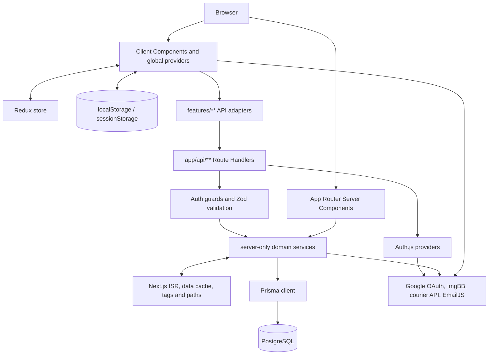

# BangBuy — Project Context and Audit

> **Snapshot:** 2026-07-25 · branch `rian-dev` · commit `8aebaaff`
>
> **Purpose:** a compact source of truth for developers and AI assistants working on this repository.
>
> **Status:** the application has strong foundations and passing static/unit checks, but it is **not production-release-ready** until the P0 security, dependency, environment, and database migration blockers below are resolved.

This document describes the repository as it existed at the snapshot above. Source code, `prisma/schema.prisma`, migrations, and current command output take precedence if this README becomes stale. No secrets, live credentials, database hostnames, customer records, or demo passwords are recorded here.

> **Security-sensitive:** the audit intentionally records unresolved exploit mechanics and evidence paths. Keep this document/repository private until the P0 findings are fixed. Before publishing the repository, replace those details with a sanitized blocker summary or move the full risk register to an access-controlled artifact.

## At a glance

BangBuy is a Bangladesh-focused, mobile-first e-commerce storefront and administration platform. The implemented catalog supports industrial automation products, electronics, daily essentials, toys, and other branded products. The current copy also sometimes presents BangBuy as a general fashion/home retailer or local multi-store marketplace; that positioning is not yet consistent and should not be treated as a settled product requirement. Although some planning copy says B2B/B2C, the repository does not implement a distinct wholesale/B2B workflow.

The application contains a broad functional storefront, credential and Google authentication, guest-to-user cart/wishlist merging, server-authoritative checkout, order tracking, and a broad administration suite. Online payment, real email/SMS order delivery, password recovery, and several operational hardening features are not complete.

| Metric | Snapshot |
| --- | ---: |
| Repository-visible files, excluding ignored dependencies/build output | 536 |
| Authored TS/TSX/CSS/Prisma files counted, excluding generated Prisma output | 509 |
| Approximate lines across those authored files | 72,305 |
| App Router page entry points | 35 |
| API Route Handler files | 71 |
| Service implementation files | 26 |
| Redux slice files | 15, of which 13 are registered |
| Explicit `"use client"` files | 160 |
| Test files | 44 |
| Passing tests | 176 |
| Prisma models | 28 |

Counts are descriptive rather than architectural contracts and will drift as the repository changes. File counts came from `rg --files`, respecting repository ignores; authored line counts cover TS, TSX, CSS, and Prisma files under the application/source directories, excluding `app/generated`.

## Technology stack

| Area | Technology |
| --- | --- |
| Application | Next.js `16.2.10` App Router, React/React DOM `19.2.4`, TypeScript |
| Styling and UI | Tailwind CSS 4, Radix UI/shadcn, Framer Motion, Lucide, `react-colorful` |
| State | Redux Toolkit `2.12.0`, React state, URL query state, browser storage |
| Authentication | Auth.js/NextAuth `5.0.0-beta.31`, JWT sessions, Credentials and Google providers, bcrypt |
| Validation and APIs | Zod 4, Next.js Route Handlers, shared response/guard/handler layers |
| Database | PostgreSQL, Prisma `7.8.0`, `@prisma/adapter-pg` |
| Caching and SEO | ISR, `unstable_cache`, tag/path revalidation, metadata APIs, JSON-LD, sitemap, robots, permanent catalog redirects |
| Reports and documents | jsPDF and jsPDF AutoTable |
| Testing and quality | Vitest 4, ESLint 9 with Next.js core-web-vitals/TypeScript rules, strict TypeScript |
| Package manager | npm with a committed `package-lock.json` |

Next.js 16 requires Node.js `>=20.9.0`; the repository does not currently pin a Node version in an engine, version-manager, or container file.

## Functional surface

### Storefront

- Homepage with carousel/category banners, categories, product discovery, and deals.
- Product directory with URL-driven search, sorting, filters, facets, pagination, responsive grids/list views, and mobile filters.
- Product details with image galleries, variants, variant-specific images, pricing and inventory state, promotions, reviews, related products, recent products, metadata, and structured data.
- Hierarchical category and brand directories/details with canonical paths and active-state filtering.
- Guest and authenticated cart/wishlist behavior, saved-for-later, promotion preview, delivery-zone pricing, and free-shipping progress.
- Authenticated checkout with server-side price/stock/promo validation and Cash on Delivery.
- Order receipt/detail with progress tracking and PDF download; order history and cancellation actions live in the profile Orders tab.
- User profile with overview, orders, cart, wishlist, profile settings, and password change.
- About, contact, privacy, return policy, and terms pages.

### Authentication

- Email/password registration and sign-in.
- Google OAuth sign-in.
- JWT sessions with `USER` and `ADMIN` roles.
- Database-refreshed admin checks for the admin layout and most admin APIs.
- Guest cart and wishlist merge into the authenticated database state after sign-in.

There is no implemented email verification or password-reset/recovery flow. Those omissions are security- and UX-relevant, not merely roadmap ideas.

### Administration

The `/admin` application covers:

- Dashboard metrics, recent orders, sales charts, top products, and activity.
- Products, variants, images, inventory, categories, brands, and manufacturers.
- Orders, status/payment transitions, customer records, and role administration.
- Reviews, testimonials, contact messages, banners, and storefront settings.
- Promotion codes, courier/fraud checks, capital and product/other costs.
- Operational activity feeds, report previews, and PDF report generation.

Admin screens are primarily client applications backed by Redux snapshots and `features/**/api.ts` adapters. The server admin layout verifies both authentication and the current database role before rendering.

### Incomplete or intentionally limited capabilities

- Checkout accepts only Cash on Delivery; online payment methods are rejected server-side.
- Order “email/SMS” notifications currently produce structured server logs rather than delivering messages.
- Address rows exist and seed/prefill checkout, but no complete user-facing address persistence workflow exists.
- Saved-for-later is browser-local, not synchronized with the user account.
- Guest quick-add wishlist entries use placeholder brand/category metadata, so local grouping or filtering can be inaccurate until server reconciliation.
- `/orders/[id]` exists, while the navbar links to a missing `/orders` index. Order history currently lives in the profile.
- “Forgot password?” returns to `/login`; recovery is not implemented.
- External ImgBB and courier requests have no explicit timeout/retry policy.

## Architecture



### Runtime boundaries and data flow

- Pages and layouts are Server Components unless marked otherwise. Public catalog pages call server-only services directly for SSR/ISR.
- Interactive, personalized, and admin features use Client Components. They call typed feature adapters, which call Route Handlers, which validate/authorize and delegate to services.
- There are no Server Actions in the current codebase; mutations flow through Route Handlers.
- Critical database, service, cache, and API modules generally use `server-only` to prevent accidental client imports. Auth policy/session/config helpers are deliberately shared or edge-safe, and `lib/auth/auth.ts` itself is not marked with that directive.
- `app/layout.tsx` loads category navigation, global metadata/JSON-LD, providers, banners, navbar, and footer.
- `app/providers.tsx` mounts Auth.js's client `SessionProvider`, a per-tree Redux store, cart/wishlist hydration, toast feedback, and a global confirmation dialog.
- Authentication routes currently receive the normal storefront banner, navbar, and footer; only `/admin` is excluded by `SiteChrome`.
- Customer page shells use client-side session/redirect/error gates rather than server authorization. Protected customer APIs are the real security boundary; hiding or redirecting a page is not authorization.
- The root layout fetches category navigation before `SiteChrome` suppresses storefront chrome on admin URLs. Consequently, admin requests still pay for a storefront category lookup.
- The ignored Prisma client is generated into `app/generated/prisma`; `npm ci` triggers generation through `postinstall`.

### Repository map

| Path | Responsibility |
| --- | --- |
| `app/(shop)` | Public and customer storefront pages |
| `app/(auth)` | Login, registration, and shared authentication UI |
| `app/admin` | Protected administrative application |
| `app/api` | Public, user, and admin Route Handlers |
| `components` | Shared layout, product, policy, SEO, and UI components |
| `features` | Client API adapters and domain-specific browser utilities |
| `lib/services` | Server-only business logic and Prisma orchestration |
| `lib/validations` | Shared Zod request/domain validation |
| `lib/api`, `lib/auth` | Response contracts, handler wrappers, guards, session/auth policy |
| `lib/cache`, `lib/seo` | Cache vocabulary/invalidation and SEO construction |
| `store` | Redux store plus customer/admin slices |
| `prisma` | Schema, additive migrations, and guarded demo seed |
| `docs` | Maintained architecture/runbook documentation |
| `public` | Logos and static images |

Some authored files are unusually large: the seed is about 1,700 lines, category/product services exceed 1,000 lines, and several admin/storefront pages and report components exceed 600 lines. These are maintainability signals, not automatic refactor requirements.

## Routes and access boundaries

| Access | Main UI routes | Behavior |
| --- | --- | --- |
| Public/indexable | `/`, `/products`, `/products/[slug]`, `/categories`, `/categories/[...segments]`, `/brands`, `/brands/[slug]`, `/about`, `/contact`, policy pages | SSR/ISR as appropriate, canonical metadata, active catalog filtering |
| Public but private/noindex in SEO terms | `/login`, `/register`, `/cart`, `/wishlist` | Dynamic/user-specific behavior; cart and wishlist support guests |
| Authenticated customer | `/checkout`, `/profile`, `/orders/[id]` | Dynamic/noindex; client-side page gates improve UX, while protected APIs enforce authorization |
| Database-verified admin | `/admin/**` | Dynamic, noindex, role-checked layout and APIs |
| Public/mixed APIs | `/api/auth/**`, catalog/product/category/brand/manufacturer reads, search/facets, reviews, contact | Each handler defines its validation/rate/auth policy |
| Authenticated APIs | `/api/user/**`, `/api/cart/**`, `/api/wishlist/**`, `/api/checkout`, `/api/orders/**`, `/api/upload` | User session required for authoritative account data |
| Admin APIs | `/api/admin/**` | Current database role required by shared guards/wrappers |

The application has 71 Route Handler files. Prefer the access families above over assuming an endpoint is public from its pathname; inspect the handler and its guard.

### API contract

Shared JSON helpers in `lib/api/response.ts` emit:

```ts
// Success
{ success: true, data: T, meta?: ApiMeta }

type ApiMeta = {
  page?: number
  pageSize?: number
  total?: number
  totalPages?: number
  [key: string]: unknown
}

// Error
{ error: string, ...optionalDetails }
```

Responses produced by these helpers are private/no-store and include `Vary: Cookie, Authorization` and `X-Content-Type-Options: nosniff`. Admin handler wrappers centralize:

1. Authentication and database-refreshed role authorization.
2. JSON content-type and payload parsing.
3. Zod validation and field-error responses.
4. Service invocation and stable response envelopes.
5. Admin activity logging.
6. Cache invalidation after a successful mutation.
7. Known not-found mappings and consistent service-error handling.

Do not bypass this flow for new admin endpoints without a documented reason.

## State and browser persistence

- Redux owns cart, wishlist, and 11 registered admin domain snapshots. There are 15 slice files; `all-products` and `home-categories` appear unused by the configured store.
- Guest cart and wishlist records are persisted in `localStorage`.
- Guest product-card wishlist quick-adds use placeholder `"BangBuy"`/`"General"` brand and category values in `components/product/ProductCard.tsx`.
- After authentication, `StoreHydrator` merges guest quantities/selections into database-backed cart and wishlist records.
- Saved-for-later remains local-only.
- Order-success pages fetch owner-scoped order data from the server. They do not trust or persist customer/order receipt snapshots in browser storage; the storage helper only removes the legacy snapshot key.
- Product filters/pagination and profile tabs use URL state so they can be refreshed or deep-linked.
- Forms and short-lived interactions generally use local React state.

## Main business workflows

### Catalog discovery and detail

1. Server-rendered home/category/brand/product pages call catalog services directly.
2. Product directory controls serialize validated state into query parameters.
3. Catalog APIs provide search and facet data for interactive discovery.
4. Only active products with an effectively active category ancestry are public.
5. Product/category/brand slug changes create permanent redirect history in the same transaction.
6. `proxy.ts` normalizes catalog URL casing and issues HTTP 308 redirects for persisted historical paths.

### Cart, wishlist, and authentication merge

1. Guests work entirely from browser persistence.
2. Auth.js resolves the authenticated session.
3. `StoreHydrator` sends merge requests and reconciles Redux with the server result.
4. Authenticated cart/wishlist services validate current product/variant relationships and stock constraints.

### Checkout and orders

1. Checkout requires authentication and gathers customer/delivery/payment input.
2. Preview recalculates product prices, variants, delivery fees, discounts, and promotion eligibility on the server.
3. Order creation repeats authoritative validation; client totals are never trusted.
4. The checkout service uses transactions, row locking/atomic stock guards, inventory logs, promotion usage, and immutable item/price/cost snapshots.
5. COD orders remain unpaid until payment is recorded. SSLCommerz checkout reserves stock and promotion usage, persists a pending payment attempt, then initializes the gateway on the server.
6. SSLCommerz browser callbacks are navigation-only. IPN processing validates the transaction server-to-server before changing payment or order state, and duplicate notifications are idempotent.
7. Cancellation/failure/expiry follows status-transition rules and restores reserved inventory and promotion usage exactly once where applicable.
8. Customer order reads are owner-scoped; elevated reads refresh the current database role rather than trusting a stale JWT role.

### Admin mutation

```text
Admin UI → feature API adapter → admin Route Handler → DB-refreshed guard
→ Zod validation → domain service/transaction → activity log → cache invalidation
```

## Data model

`prisma/schema.prisma` defines 29 models:

| Domain | Models |
| --- | --- |
| Identity and abuse controls | `User`, `Address`, `RateLimitBucket` |
| Catalog and inventory | `Category`, `Brand`, `Manufacturer`, `Product`, `CatalogRedirect`, `ProductVariant`, `ProductImage`, `InventoryLog` |
| Shopping state | `CartItem`, `Wishlist` |
| Orders and payments | `Order`, `OrderItem`, `OrderStatusHistory`, `PaymentTransaction` |
| Promotion and public content | `PromoCode`, `PromoCodeUsage`, `Review`, `Testimonial`, `Banner`, `ContactMessage`, `StoreSettings` |
| Admin finance and audit | `AdminCapital`, `AdminProductCost`, `AdminOtherCost`, `AdminCapitalCostActivity`, `AdminActivityLog` |

Important invariants:

- Categories are hierarchical and public visibility depends on active ancestry.
- Products have generic variants, multiple images, inventory state, SEO fields, and redirect history.
- Money uses Prisma Decimal-backed handling rather than binary floating-point arithmetic.
- Order items snapshot mutable catalog information so historical orders do not change when products do.
- Inventory movements, order transitions, promotion usage, and provider payment attempts have explicit records. SSLCommerz metadata, validation identity, risk state, idempotency identity, and gateway-session state are stored on `PaymentTransaction`.
- Catalog SEO fields and redirects depend on the pending `20260722000000_catalog_seo_redirects` migration.

## Caching, rendering, and SEO

The current implementation uses `unstable_cache`, ISR route revalidation, dependency tags, and targeted tag/path invalidation.

| Surface | Current strategy |
| --- | --- |
| Homepage | ISR, 600-second fallback |
| Clean product listing pages | Dynamic SSR with bounded 900-second data caching |
| Product detail | Hybrid ISR, popular products pre-generated, 900-second fallback |
| Category/brand directories and details | ISR/hybrid ISR, 1,800-second fallback |
| About/contact | ISR, 3,600-second fallback |
| Policy pages | ISR, 21,600-second fallback |
| Sitemap | Cached metadata route, 3,600-second fallback |
| Auth/customer/admin pages | Dynamic and `noindex` |
| Shared JSON APIs | Private/no-store responses |

Catalog mutations invalidate aggregate listing/facet/home data plus exact product, category ancestry, brand, manufacturer, review, redirect, sitemap, and route dependencies as applicable. Time-based revalidation is a fallback when on-demand invalidation fails.

SEO coverage is a strong area:

- Centralized canonical origin, metadata, Open Graph, Twitter, and indexing policy.
- Dynamic product/category/brand metadata with sanitization and bounded text.
- Organization, WebSite, product/product-group, offer, aggregate rating, and breadcrumb JSON-LD.
- Clean pagination indexing, filtered/search URL noindex rules, lowercase canonicalization, and permanent historical redirects.
- Active-entity sitemap filtering and robots rules.
- Private/auth/admin layouts emit noindex behavior.

See [`docs/seo-performance-architecture.md`](docs/seo-performance-architecture.md) for the detailed rendering matrix, tag vocabulary, mutation invalidation matrix, deployment order, smoke tests, rollback guidance, and optional Nginx considerations.

Next.js 16 documentation marks `unstable_cache` as replaced by the `use cache` directive when Cache Components are enabled. Cache Components are not enabled here. Any migration must preserve the current dependency-tag and invalidation behavior; do not perform a mechanical replacement.

## External integrations

| Integration | Purpose | Current caveat |
| --- | --- | --- |
| SSLCommerz | Server-initiated online checkout with authoritative IPN validation | Requires private merchant credentials, a public HTTPS callback origin, and an external reconciliation scheduler |
| Google OAuth | Authentication | Unsafe automatic email linking is a P0 finding |
| ImgBB | Product/profile image uploads | No explicit timeout/retry; upload size enforcement occurs too late |
| Courier/customer information API | Fraud/courier checks | No explicit timeout/retry; service availability affects the feature |
| EmailJS | Optional best-effort contact notification after `/api/contact` persists the message | IDs/public key are intentionally browser-visible; notification failure does not undo the saved message |
| Google Maps embed | Contact/location UI | Presentation-only |
| DiceBear | Placeholder avatars | Third-party image/network dependency |
| jsPDF | Order/admin PDF export | Generated in application code, not a document service |

## Environment contract

Use `.env.example` as the key-name contract. Never copy real values into documentation, commits, screenshots, prompts, or test fixtures.

| Variable | Exposure | Purpose |
| --- | --- | --- |
| `SITE_URL` | Server | Canonical origin; production must be an HTTPS origin |
| `NEXT_PUBLIC_SITE_URL` | Public | Compatibility origin; keep aligned with `SITE_URL` |
| `DATABASE_URL` | Secret/server | PostgreSQL connection used by Prisma |
| `AUTH_URL` | Server/security-critical | Auth.js origin and trusted origin for custom registration/contact checks; configure it explicitly because those checks currently fail open when it is absent |
| `AUTH_SECRET` | Secret/server | Auth.js signing/encryption secret |
| `AUTH_GOOGLE_ID` | Server configuration | Google OAuth client ID |
| `AUTH_GOOGLE_SECRET` | Secret/server | Google OAuth client secret |
| `IMGBB_API_KEY` | Secret/server | ImgBB upload API |
| `CUSTOMER_INFO_CHECKER_API` | Secret/server | Courier/customer information API |
| `SSLCOMMERZ_STORE_ID` | Secret/server | SSLCommerz merchant store identifier |
| `SSLCOMMERZ_STORE_PASSWORD` | Secret/server | SSLCommerz merchant API password |
| `SSLCOMMERZ_IS_LIVE` | Server configuration | Explicit `false` for sandbox or `true` for live endpoints; no implicit environment fallback |
| `PAYMENT_RECONCILIATION_SECRET` | Secret/server | High-entropy bearer secret for the private reconciliation trigger |
| `NEXT_PUBLIC_EMAILJS_SERVICE_ID` | Public | EmailJS browser service ID |
| `NEXT_PUBLIC_EMAILJS_TEMPLATE_ID` | Public | EmailJS browser template ID |
| `NEXT_PUBLIC_EMAILJS_PUBLIC_KEY` | Public | EmailJS browser public key |
| `ALLOW_DEMO_SEED` | Server safeguard | Explicitly permits demo seeding outside the normal production block |
| `NODE_ENV` | Runtime-managed | Development/production behavior; normally let Next.js/npm set it |

The local example uses an HTTP localhost origin, which is valid for development but intentionally fails a production build. A production-mode build needs an HTTPS `SITE_URL`.

## Local development and release commands

### Install and configure

```powershell
npm ci
if (-not (Test-Path .env)) { Copy-Item .env.example .env }
npx prisma validate
npx prisma migrate status
npm run dev
```

For non-PowerShell shells, create `.env` from `.env.example` using the equivalent copy command. `npm ci` runs `prisma generate` through `postinstall`.

Before applying or creating a migration, verify `DATABASE_URL` targets the intended database and use the appropriate environment workflow:

- Development: `npx prisma migrate dev`
- Staging/production: back up/snapshot first, then `npx prisma migrate deploy`

Never use `prisma migrate reset` against a shared or production database.

### SSLCommerz operations

Set the four server-only payment variables from `.env.example`. The canonical `SITE_URL` must be a publicly reachable HTTPS origin for gateway callbacks and IPN delivery. In development, use a trusted HTTPS tunnel and set `SITE_URL` to that origin.

The reconciliation handler is intentionally an authenticated trigger, not an in-process timer. Configure the deployment scheduler to `POST /api/payments/sslcommerz/reconcile` every 5–10 minutes with `Authorization: Bearer <PAYMENT_RECONCILIATION_SECRET>`. Use a random secret of at least 32 characters. This sweep queries SSLCommerz for stale pending attempts and safely applies terminal provider state.

Provider-risk, duplicate-charge, late-charge, and validation-mismatch findings place the order on an admin-visible fulfillment hold. An admin may approve a verified successful payment, or—only after completing the refund in SSLCommerz—record the external refund reference and cancel/release the reservation. BangBuy records that evidence but does not initiate provider refunds.

### Quality gates

```powershell
npm run lint
npx tsc --noEmit
npx vitest run
npm run build
```

`package.json` currently has no `test` or `typecheck` scripts, so the explicit Vitest and TypeScript commands are intentional.

### Demo seed

The Prisma seed creates broad demo catalog, user, order, banner, financial, and activity data. It is guarded in production unless `ALLOW_DEMO_SEED=true`, but it still contains predictable demo identities/credentials by design. Never enable or run it on an accessible production database without an explicit, reviewed data plan.

### Production release order

1. Confirm the target environment and take a database snapshot.
2. Configure production HTTPS origin, database, Auth.js, and integration variables.
3. Run `npm ci`.
4. Run Prisma validation and migration status.
5. Deploy pending additive migrations before building code that reads their columns.
6. Generate the Prisma client if the install lifecycle did not.
7. Run lint, TypeScript, tests, dependency audit, and production build.
8. Deploy the exact tested artifact and perform public/private smoke checks. For a self-hosted Node deployment, start it with `npm start`; no hosting target is established in this repository.

## Verified health snapshot

These commands were run from the repository root on 2026-07-25 without modifying tracked runtime files.

| Check | Result | Evidence/interpretation |
| --- | --- | --- |
| `npm run lint` | Pass | ESLint completed with exit code 0 |
| `npx tsc --noEmit` | Pass | Strict project type-check completed with exit code 0 |
| `npx vitest run` | Pass | 44 files and 176 tests passed |
| `npm run build` | Fail | Compilation and TypeScript pass; initial page collection rejects the local HTTP `SITE_URL` in production mode |
| Build with a temporary HTTPS origin | Fail | Page collection reaches Prisma, then the connected database lacks `Category.seoTitle` from the pending migration |
| `npx prisma migrate status` | Fail/release blocker | `20260722000000_catalog_seo_redirects` is not applied to the inspected database |
| `npm audit --omit=dev` | Fail | 2 critical, 4 high, 4 moderate production-tree advisories |
| Full `npm audit` | Fail | 2 critical, 12 high, 4 moderate advisories including developer tooling |
| Git worktree before README implementation | Clean | Branch `rian-dev`, commit `8aebaaff` |

The build is **not** considered passing. The failures are currently environmental/database release blockers after successful compilation, not proof that runtime behavior is otherwise production-safe.

Audit output is time-sensitive. At this snapshot, direct upgrade candidates include Next.js `16.2.11` and NextAuth beta 32, but upgrades must be performed on a reviewable branch and followed by full lint, type, test, build, auth, and audit regression checks.

## Verified strengths

- Strict TypeScript, Next.js ESLint rules, and all current automated tests pass.
- Server-only boundaries make accidental database/secret imports into client code less likely.
- API response envelopes, validation, authorization helpers, service errors, and admin handlers are centralized.
- Checkout and order logic recalculate authoritative values, use database transactions and stock guards, preserve snapshots, and write inventory/status history.
- Admin role checks usually refresh the current database role rather than trusting a JWT indefinitely.
- Catalog caching has explicit dependency vocabulary and mutation-aware invalidation rather than broad cache flushing alone.
- SEO implementation covers metadata, canonicals, structured data, sitemap/robots, noindex behavior, and redirect history.
- Responsive storefront/admin patterns, loading states, mobile drawers, and product/search interactions are extensive.
- `.env*`, generated Prisma output, build output, coverage, and TypeScript build state are ignored appropriately; only `.env.example` is opted into version control.

## Prioritized audit findings

Priority labels here combine exploitability, data exposure, release impact, and user impact. They are not formal CVSS scores or a substitute for a professional penetration test.

### P0 — block release (security defects and release preconditions)

| Finding | Evidence and impact | Required direction |
| --- | --- | --- |
| Untrusted login callback can become navigation XSS | `app/(auth)/login/page.tsx` reads `callbackUrl` and passes it to `router.push`. Next.js explicitly warns that `javascript:` values execute in page context. Successful exploitation can also read other same-origin browser state, although order receipt snapshots are no longer stored there. | Accept only validated same-origin application paths; reject schemes, protocol-relative URLs, control characters, and external origins. Add malicious and valid callback regression tests. |
| Google email auto-linking enables account pre-hijacking | Credential registration accepts an unverified email. `lib/auth/auth.ts` later links Google sign-in by email while preserving an existing password. An attacker can pre-register a victim's Google address and retain credential access. | Require verified ownership before credential activation/linking, or require authenticated explicit provider linking. Never auto-link solely because email strings match. |
| Production dependency advisories | `npm audit --omit=dev` reports 2 critical, 4 high, and 4 moderate advisories, including the direct NextAuth/Next.js dependency paths. | Upgrade direct dependencies deliberately, review changelogs against installed Next.js docs, regenerate the lockfile, and rerun the full release/auth suite and audit. |
| Inspected database schema is behind application code | Prisma reports `20260722000000_catalog_seo_redirects` pending on the configured database. Build-time catalog reads expect columns such as `Category.seoTitle`, so page-data collection fails there. | Confirm the intended target, take a snapshot, review and deploy the additive migration before the application build, confirm migration status, then rebuild. |
| HTTPS canonical origin is a production-build precondition | The normal local-development `SITE_URL` is HTTP. Production-mode canonical validation correctly requires HTTPS and stops page collection before the schema failure is reached. | Configure a real HTTPS origin for staging/production builds and keep public/server origins aligned. Do not weaken canonical validation to accommodate a production HTTP URL. |

### P1 — harden before broad production use

| Finding | Evidence and impact | Recommended direction |
| --- | --- | --- |
| Rate limiting is not production-distributed | `lib/auth/rate-limit.ts` uses process memory, trusts forwarded IP input, and does not prune a large set of unique keys. Multi-instance deployments can bypass limits and long-running instances can accumulate keys. | Use trusted-proxy-aware client identity plus a shared bounded store with atomic expiry. Cover registration/login/contact/upload/checkout abuse paths. |
| JWT/session revocation is incomplete | Password changes and role/account changes do not invalidate all existing JWTs; ordinary user guards do not always verify the current user still exists. | Add a session/token version or equivalent revocation check for sensitive operations and revoke sessions after security changes. |
| Password byte-limit handling is incomplete | Policy limits JavaScript characters to bcrypt's 72 boundary, but bcrypt truncation is based on UTF-8 bytes. Different long Unicode strings can become equivalent. | Validate the UTF-8 byte length before hashing/comparison and add Unicode boundary tests. |
| Activity display identity is client-influenceable | Auth.js session updates can rewrite JWT name/image fields supplied by the client. Admin activity IDs/emails remain intact, but displayed actor names can be misleading. | Resolve audit display identity from authoritative user data or constrain and verify allowed session-update fields. |
| Custom origin checks fail open without `AUTH_URL` | Registration/contact origin validation accepts requests when the trusted Auth.js origin is not configured, weakening the intended cross-origin protection. | Require and validate `AUTH_URL` during non-development startup and add missing/malformed/mismatched-origin tests. |
| Security response headers are incomplete | `next.config.ts` defines image hosts but no repository-level CSP, HSTS, frame, referrer, or permissions policy. | Design a CSP around required OAuth, ImgBB, EmailJS, maps, images, and Next.js behavior; add headers incrementally and verify in browsers. |
| Payment-status changes lack immutable history | Admin payment-state updates write `Order.paymentStatus` directly; `PaymentTransaction` is currently used for admin advances, not a general payment audit trail. | Define payment event semantics and append immutable actor/time/reason records for financially significant changes. |
| Upload and high-value write protections need work | Upload parsing occurs before the 32 MB check. Any authenticated caller can consume shared external upload capacity behind a per-IP, in-memory 30/minute limit; COD order creation is not rate-limited. | Reject by content length where possible, stream/bound parsing, validate actual type, reduce quotas, and rate-limit costly writes. |
| External calls lack resilience | ImgBB and courier calls have no explicit timeout/retry/circuit policy. | Add bounded timeouts, carefully scoped retries, user-safe errors, and observability without logging secrets/PII. |
| Last-admin protection can race | A count-then-update role change is not one atomic transaction/lock. Concurrent requests could remove the final admin. | Enforce the invariant transactionally and add a concurrency-focused service test. |
| Demo seed is operationally dangerous | The seed is intentionally broad and uses predictable demo access data. The environment guard can be explicitly bypassed. | Keep production seeding disabled, restrict database/network access, and rotate/remove demo identities from any shared environment. |
| Several navigation/actions are broken | Navbar `/orders` has no page; forgot-password loops to login; terms/privacy links in auth/contact point to `/about`; product list-view wishlist control has no handler. | Fix destinations/actions together with route/component tests and a browser smoke journey. |
| Product promises conflict with behavior | Policy copy promises guest checkout, but checkout redirects to login. Same-day claims conflict with a hardcoded four-day estimate. | Settle the product rules, make UI/policies/calculation agree, and treat policy text as release-controlled content. |
| Accessibility has material gaps | Some visual labels lack reliable `id`/`htmlFor`; confirmation/admin navigation focus management is incomplete; reduced-motion coverage is sparse; some shells lack a main landmark; homepage H1 can disappear. | Correct accessible names/landmarks, implement modal/drawer focus and inert behavior, respect reduced motion, and add automated plus manual screen-reader/keyboard checks. |
| Automated coverage is layer-heavy | Existing tests focus on services, validation, caching, and a few routes. There is no CI, browser E2E suite, automated accessibility suite, or meaningful component coverage; no `test` script exists. | Add stable scripts and CI gates first, then cover P0 regressions and core browse→cart→login→checkout→order/admin journeys. |

### P2 — maintainability and product-quality debt

| Finding | Impact | Recommended direction |
| --- | --- | --- |
| Next.js cache API transition | At least 21 authored files reference `unstable_cache`, which Next.js 16 documents as superseded when adopting Cache Components. | Design and test a deliberate cache migration; preserve tags, invalidation, private data isolation, and self-hosted behavior. |
| Redirect lookup may not scale | `proxy.ts` is on the request hot path and its service can load/cache a broad redirect index. Redirect history growth can increase latency/memory; Next.js discourages slow data fetching in Proxy. | Benchmark realistic redirect volume and prefer bounded/direct lookup or generated redirect data with fail-open behavior. |
| Excessive root/admin work | The root layout loads storefront category navigation even for admin requests, then a client component hides the chrome. | Split route-group layouts or otherwise prevent irrelevant admin data work without making public pages dynamic. |
| Large modules concentrate responsibility | Seed, category/product services, reports, banners, cart/order pages, and navbar contain hundreds to more than a thousand lines. | Refactor only along stable domain/use-case seams with tests; avoid cosmetic fragmentation. |
| UI primitives are inconsistently adopted | More than 200 raw `<button>` elements coexist with a shared Button used in only a few files. Repeated styling and behavior can drift. | Standardize accessible control variants incrementally during feature work. |
| Dark mode is not a real feature | Dark tokens exist, but no theme activator is present and hardcoded white/gray styles dominate. | Either complete and test theme behavior or remove misleading dead tokens until it is prioritized. |
| Unused/dead code exists | Unregistered `all-products`/`home-categories` slices and apparently unused admin components increase context and maintenance cost. | Confirm with references/build analysis, then remove in a dedicated cleanup change. |
| Guest wishlist metadata is synthetic | Product-card quick-adds store placeholder brand/category values, which can make guest grouping/filtering inaccurate before server reconciliation. | Persist real card metadata or derive it from the authoritative product during reconciliation. |
| Product identity is inconsistent | Copy spans industrial/B2B, general consumer fashion/home, and a local marketplace model; delivery claims also diverge. | Establish a product-positioning/content source of truth and update metadata, policies, homepage, and operational rules together. |
| Error UX relies on framework defaults | No custom route-level `error.tsx` or `not-found.tsx` exists. | Add branded, accessible recovery states where they improve real failure journeys. |

## Remediation roadmap

### P0 sequence

1. Fix and regression-test callback URL validation, provider linking/verification, and stale-role order access.
2. Upgrade vulnerable direct production dependencies and rerun audit plus auth/security regression tests.
3. Set the intended HTTPS environment, snapshot the correct database, deploy the pending additive migration, and prove `prisma migrate status` is clean.
4. Run lint, TypeScript, all tests, production build, and targeted public/private smoke checks against the migrated environment.

### P1 sequence

1. Add revocable sessions/current-user checks, byte-correct password policy, distributed rate limiting, upload controls, timeouts, and reviewed security headers.
2. Repair broken navigation/actions and reconcile checkout, delivery, and policy promises.
3. Close accessible-name, landmark, focus-management, and reduced-motion gaps.
4. Add explicit test/typecheck scripts and CI; prioritize P0 security regressions and core E2E/a11y journeys.

### P2 sequence

1. Measure proxy/cache behavior, then plan Next.js cache modernization and root-layout optimization.
2. Split the largest modules at tested domain boundaries and remove confirmed dead code.
3. Consolidate UI primitives, decide dark-mode scope, and add branded error states.
4. Settle product positioning and incomplete integration/product capabilities before expanding public claims.

## Audit limitations

This snapshot included repository-wide static inspection, configuration/schema/migration review, installed Next.js 16 documentation review, lint, strict type-checking, all current Vitest tests, dependency audit, Prisma migration status, and production build attempts.

It did **not** include:

- Browser-driven or end-to-end execution.
- Manual screen-reader, keyboard-only, or real-device validation.
- Lighthouse, bundle analysis, load testing, or real-user monitoring.
- Live OAuth, EmailJS, ImgBB, courier, maps, or notification delivery checks.
- A production deployment, reverse-proxy inspection, multi-instance cache test, or observability review.
- Destructive database operations, migration deployment, seeding, or data changes.
- A formal penetration test, legal review, privacy assessment, or PCI/payment review.

Build and migration commands made read-only queries against the configured database; no database writes were performed during the audit. Findings should be independently verified when their code or environment changes.

## AI collaboration guide

When this README is attached to a ChatGPT/Codex project:

1. Treat it as a dated map, not a substitute for reading the current files.
2. Follow `AGENTS.md`. Before changing Next.js behavior, read the relevant installed guide under `node_modules/next/dist/docs/`; this project uses Next.js 16 conventions, including `proxy.ts` and Promise-based route params.
3. Do not add ambient/external type declaration files as a shortcut around library or application typing.
4. Preserve the normal layers:
   - Server-rendered public page → server-only service.
   - Interactive client → feature API adapter → Route Handler → guard/validation → service → Prisma.
5. Keep secrets server-only. Never print or copy `.env` values, database connection details, auth tokens, API secrets, or customer/order PII.
6. Do not trust a JWT role for sensitive authorization when role/account state can change; refresh authoritative database state.
7. Keep client totals untrusted. Pricing, promotions, inventory, delivery fees, and order transitions remain server-authoritative and transactional.
8. Any public catalog mutation must account for precise cache/tag/path invalidation, sitemap visibility, metadata, active category ancestry, and redirect history.
9. Preserve the shared private/no-store API envelope unless an endpoint explicitly requires a different reviewed cache contract.
10. Deploy additive schema changes before code/build steps that read the new fields. Never reset or seed an unconfirmed database.
11. Do not report a finding as fixed until the implementation and targeted regression test exist and the relevant quality gates pass.
12. Keep unrelated user changes intact; use small reviewable diffs and avoid destructive Git/database operations.

### Sources of truth

Use this precedence when documents disagree:

1. Current implementation, tests, Prisma schema, and applied database migrations.
2. [`AGENTS.md`](AGENTS.md) for repository working rules.
3. [`docs/seo-performance-architecture.md`](docs/seo-performance-architecture.md) for the implemented SEO/cache/release design.
4. [`.env.example`](.env.example) for environment key names only.
5. This README for the dated cross-project summary and audit.

`SEO_plan.md` is historical planning/prompt input. It is useful for intent, but it is not authoritative evidence that every requested behavior is currently implemented or verified.

## Keeping this document current

Update the snapshot date/commit and affected sections when any of these change:

- Next.js/Auth.js/Prisma versions or caching conventions.
- Page/API route families, authentication boundaries, or response contracts.
- Prisma models, migrations, checkout/order/inventory invariants.
- Environment variables, external integrations, or deployment order.
- Product positioning, payment/notification capabilities, or policy promises.
- Resolution or discovery of P0/P1 findings.
- Test counts, CI coverage, build/migration status, or dependency audit results.

Do not silently delete a risk because work started. Mark it resolved only with the implementing commit, relevant tests, and fresh verification evidence.
