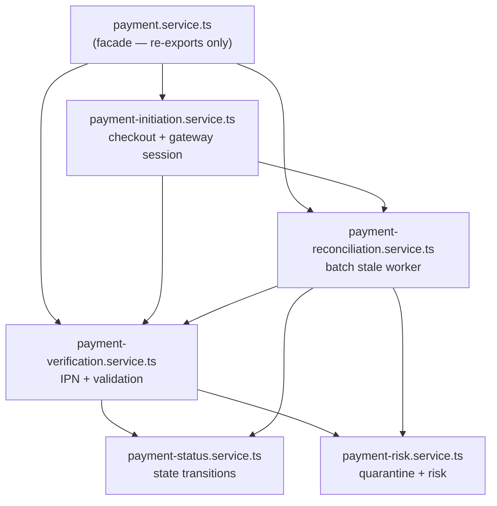

# Payment Module Restructuring — Walkthrough

## Summary

Restructured all payment-related code from 3 scattered directories into a centralized `lib/payments/` domain module with clear sub-module boundaries, then decomposed the monolithic orchestration layer into focused single-responsibility services. **Zero behavioral changes** — only structural reorganization.

## Results

| Metric | Result |
|---|---|
| TypeScript compilation | ✅ Zero errors |
| Test suite | ✅ 64 files, 322 tests, all passing |
| Stale imports in `app/` | ✅ Zero |
| Deprecated shims remaining | ✅ Zero (all deleted) |
| Security guarantees | ✅ All preserved |

---

## Directory Structure

```
lib/payments/
├── index.ts                                    ← barrel (public API)
│
├── core/
│   ├── payment.service.ts                      ← thin facade (re-exports only)
│   ├── payment-initiation.service.ts           ← checkout flow + gateway session lifecycle
│   ├── payment-verification.service.ts         ← IPN processing + provider validation
│   ├── payment-status.service.ts               ← state transitions + order updates
│   ├── payment-risk.service.ts                 ← quarantine + risk assessment
│   ├── payment.constants.ts                    ← PROVIDER, amount limits, batch sizes
│   ├── payment.errors.ts                       ← PaymentError, CommittedPaymentError
│   └── payment.types.ts                        ← provider-agnostic types
│
├── gateways/
│   └── sslcommerz/
│       ├── sslcommerz.client.ts                ← HTTP layer (fetch, timeouts, form building)
│       ├── sslcommerz.service.ts               ← session, validation, query orchestration
│       ├── sslcommerz.schemas.ts               ← all Zod schemas
│       ├── sslcommerz.types.ts                 ← SSLCommerz-specific types + error classes
│       └── sslcommerz.constants.ts             ← endpoints, timeout
│
├── callbacks/
│   └── payment-callback.service.ts             ← browser redirect handler (UX only)
│
├── transactions/
│   ├── payment-transaction.service.ts          ← customer/admin ledger queries
│   └── payment-transitions.ts                  ← payment state machine rules
│
├── reconciliation/
│   ├── payment-reconciliation.service.ts       ← batch stale payment worker
│   └── reconciliation-security.ts              ← timing-safe bearer auth
│
├── validation/
│   ├── payment.schema.ts                       ← IPN notification schema
│   └── payment-transaction.schema.ts           ← transaction query schemas
│
└── __tests__/
    ├── helpers.ts                              ← shared fixtures & factories
    ├── payment-initiation.test.ts              ← checkout flow tests (5 tests)
    ├── payment-verification.test.ts            ← IPN processing tests (16 tests)
    ├── payment-reconciliation.test.ts          ← stale reconciliation tests (8 tests)
    ├── payment-callback.test.ts                ← browser callback tests
    └── sslcommerz.test.ts                      ← gateway client tests
```

---

## Key Architectural Decisions

### 1. Service Decomposition via Thin Facade

The original 1524-line monolithic `payment.service.ts` was decomposed into 5 focused sub-services. The facade file now contains only re-exports:



| Module | Key Functions | Approx Lines |
|---|---|---|
| `payment-risk.service.ts` | `quarantinePaymentAttempt`, `assessProviderRisk` | ~60 |
| `payment-status.service.ts` | `applySuccessfulPayment`, `applyFailedPayment`, `applyExpiredPayment` | ~120 |
| `payment-verification.service.ts` | `processSslCommerzNotification`, `mapProviderValidationError` | ~180 |
| `payment-reconciliation.service.ts` | `reconcileStaleSslCommerzPayments`, `reconcilePaymentAttempt` | ~200 |
| `payment-initiation.service.ts` | `initiateSslCommerzCheckout`, `assertSslCommerzConfiguration` | ~300 |
| `payment.service.ts` (facade) | Re-exports only | ~18 |

### 2. Import Splitting for Testability

Route handlers import **service functions from the barrel** and **schemas/utilities from specific paths**:
```ts
import { processSslCommerzNotification } from "@/lib/payments";          // barrel
import { sslCommerzNotificationSchema } from "@/lib/payments/validation/payment.schema";  // specific
```
This prevents vitest mock of the barrel from accidentally eliminating unmocked Zod schemas.

### 3. Order Domain Stays Put

`lib/orders/mutations.ts` and `lib/orders/status.ts` were **not moved** into the payment module. They are shared by non-payment order workflows (admin cancellation, customer cancellation). The payment module imports them as external dependencies.

### 4. All Deprecated Shims Deleted

All 8 backward-compatibility shim files were deleted after all imports were migrated to their final locations:

| Deleted Shim | Was Pointing To |
|---|---|
| `lib/payments/payment.service.ts` (root) | `core/payment.service` |
| `lib/payments/sslcommerz.ts` | `gateways/sslcommerz/sslcommerz.service` |
| `lib/payments/payment.types.ts` (root) | `gateways/sslcommerz/sslcommerz.types` |
| `lib/payments/callback.ts` | `callbacks/payment-callback.service` |
| `lib/payments/transactions/payment-locks.ts` | `lib/orders/mutations` |
| `lib/services/payment-transaction.service.ts` | `payments/transactions/payment-transaction.service` |
| `lib/validations/payment.validation.ts` | `payments/validation/payment.schema` |
| `lib/validations/payment-transaction.validation.ts` | `payments/validation/payment-transaction.schema` |

---

## Files Changed

### New Files (22)
| File | Purpose |
|---|---|
| [index.ts](file:///e:/RunningProject/bangbuy/lib/payments/index.ts) | Barrel / public API |
| [payment.constants.ts](file:///e:/RunningProject/bangbuy/lib/payments/core/payment.constants.ts) | Provider name, amount limits, batch sizes |
| [payment.errors.ts](file:///e:/RunningProject/bangbuy/lib/payments/core/payment.errors.ts) | PaymentError, CommittedPaymentError |
| [payment.types.ts](file:///e:/RunningProject/bangbuy/lib/payments/core/payment.types.ts) | Provider-agnostic types |
| [payment.service.ts](file:///e:/RunningProject/bangbuy/lib/payments/core/payment.service.ts) | Thin facade (re-exports) |
| [payment-initiation.service.ts](file:///e:/RunningProject/bangbuy/lib/payments/core/payment-initiation.service.ts) | Checkout + gateway session lifecycle |
| [payment-verification.service.ts](file:///e:/RunningProject/bangbuy/lib/payments/core/payment-verification.service.ts) | IPN processing + provider validation |
| [payment-status.service.ts](file:///e:/RunningProject/bangbuy/lib/payments/core/payment-status.service.ts) | State transitions + order updates |
| [payment-risk.service.ts](file:///e:/RunningProject/bangbuy/lib/payments/core/payment-risk.service.ts) | Quarantine + risk assessment |
| [sslcommerz.constants.ts](file:///e:/RunningProject/bangbuy/lib/payments/gateways/sslcommerz/sslcommerz.constants.ts) | Gateway endpoints |
| [sslcommerz.schemas.ts](file:///e:/RunningProject/bangbuy/lib/payments/gateways/sslcommerz/sslcommerz.schemas.ts) | Zod schemas |
| [sslcommerz.client.ts](file:///e:/RunningProject/bangbuy/lib/payments/gateways/sslcommerz/sslcommerz.client.ts) | HTTP layer |
| [sslcommerz.service.ts](file:///e:/RunningProject/bangbuy/lib/payments/gateways/sslcommerz/sslcommerz.service.ts) | Domain service |
| [sslcommerz.types.ts](file:///e:/RunningProject/bangbuy/lib/payments/gateways/sslcommerz/sslcommerz.types.ts) | SSLCommerz types |
| [payment-callback.service.ts](file:///e:/RunningProject/bangbuy/lib/payments/callbacks/payment-callback.service.ts) | Browser callback handler |
| [payment-transaction.service.ts](file:///e:/RunningProject/bangbuy/lib/payments/transactions/payment-transaction.service.ts) | Transaction ledger |
| [payment-transitions.ts](file:///e:/RunningProject/bangbuy/lib/payments/transactions/payment-transitions.ts) | State machine |
| [payment-reconciliation.service.ts](file:///e:/RunningProject/bangbuy/lib/payments/reconciliation/payment-reconciliation.service.ts) | Batch stale payment worker |
| [reconciliation-security.ts](file:///e:/RunningProject/bangbuy/lib/payments/reconciliation/reconciliation-security.ts) | Timing-safe auth |
| [payment.schema.ts](file:///e:/RunningProject/bangbuy/lib/payments/validation/payment.schema.ts) | IPN notification schema |
| [payment-transaction.schema.ts](file:///e:/RunningProject/bangbuy/lib/payments/validation/payment-transaction.schema.ts) | Transaction query schemas |
| [helpers.ts](file:///e:/RunningProject/bangbuy/lib/payments/__tests__/helpers.ts) | Shared test fixtures |

### Modified Files (14)
| File | Change |
|---|---|
| Route: [ipn/route.ts](file:///e:/RunningProject/bangbuy/app/api/payments/sslcommerz/ipn/route.ts) | Import from barrel + validation path |
| Route: [reconcile/route.ts](file:///e:/RunningProject/bangbuy/app/api/payments/sslcommerz/reconcile/route.ts) | Import from barrel + security path; inline auth removed |
| Route: [success/route.ts](file:///e:/RunningProject/bangbuy/app/api/payments/sslcommerz/success/route.ts) | Import from barrel |
| Route: [fail/route.ts](file:///e:/RunningProject/bangbuy/app/api/payments/sslcommerz/fail/route.ts) | Import from barrel |
| Route: [cancel/route.ts](file:///e:/RunningProject/bangbuy/app/api/payments/sslcommerz/cancel/route.ts) | Import from barrel |
| Route: [checkout/route.ts](file:///e:/RunningProject/bangbuy/app/api/checkout/route.ts) | Import from barrel |
| Route: [transactions/route.ts](file:///e:/RunningProject/bangbuy/app/api/transactions/route.ts) | Import from barrel + validation path |
| Route: [admin/transactions/route.ts](file:///e:/RunningProject/bangbuy/app/api/admin/transactions/route.ts) | Import from barrel + validation path |
| Test: [ipn/route.test.ts](file:///e:/RunningProject/bangbuy/app/api/payments/sslcommerz/ipn/route.test.ts) | Mock path updated |
| Test: [reconcile/route.test.ts](file:///e:/RunningProject/bangbuy/app/api/payments/sslcommerz/reconcile/route.test.ts) | Mock path updated |
| Test: [checkout/route.test.ts](file:///e:/RunningProject/bangbuy/app/api/checkout/route.test.ts) | Mock path updated |
| Test: [transactions/route.test.ts](file:///e:/RunningProject/bangbuy/app/api/transactions/route.test.ts) | Mock path updated |
| Test: [admin/transactions/route.test.ts](file:///e:/RunningProject/bangbuy/app/api/admin/transactions/route.test.ts) | Mock path updated |
| Test: [payment-transaction.service.test.ts](file:///e:/RunningProject/bangbuy/lib/services/payment-transaction.service.test.ts) | Import path updated |

---

## Security Verification

| Control | Status |
|---|---|
| `import "server-only"` on credential-handling modules | ✅ `sslcommerz.client.ts`, `sslcommerz.service.ts`, `payment-callback.service.ts`, `reconciliation-security.ts`, `payment-transaction.service.ts`, `payment-initiation.service.ts`, `payment-verification.service.ts` |
| `crypto.timingSafeEqual()` for reconciliation auth | ✅ Preserved in `reconciliation-security.ts` |
| Pessimistic locking (`SELECT ... FOR UPDATE`) | ✅ Still from `lib/orders/mutations.ts` |
| Zero-trust pricing (server-authoritative amounts) | ✅ Unchanged in `payment-initiation.service.ts` |
| Browser callbacks never mutate payment state | ✅ Unchanged in `payment-callback.service.ts` |
| IPN uses server-to-server validation | ✅ Unchanged in `payment-verification.service.ts` |
| `requiresReview` quarantine logic | ✅ Preserved in `payment-risk.service.ts` |
| No credentials in barrel exports | ✅ Verified |
